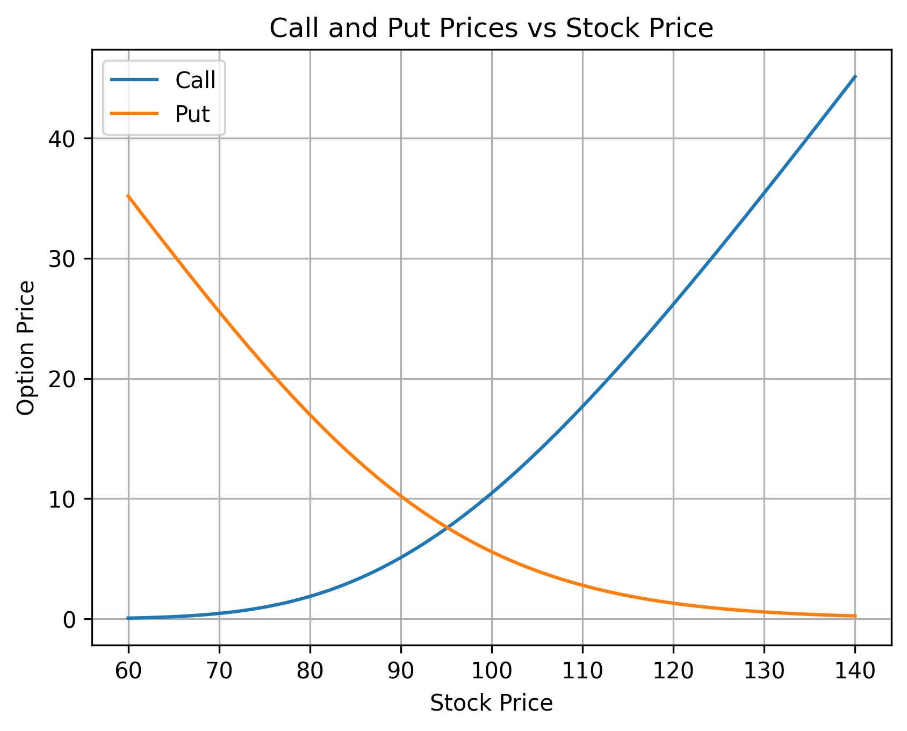
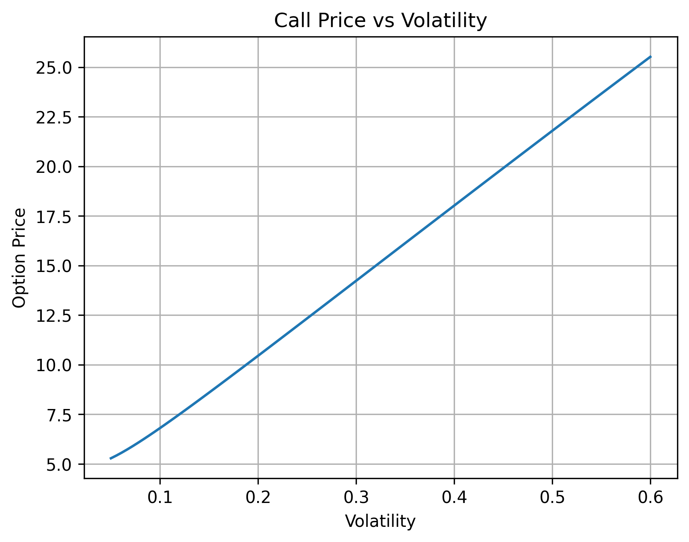
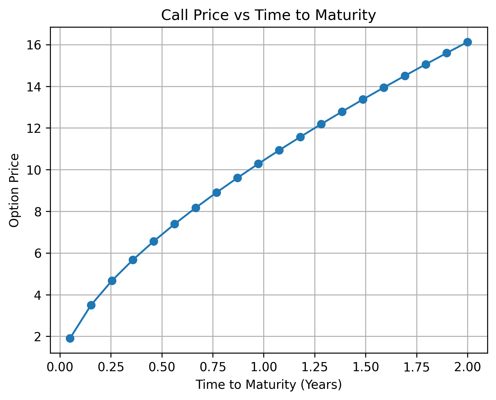
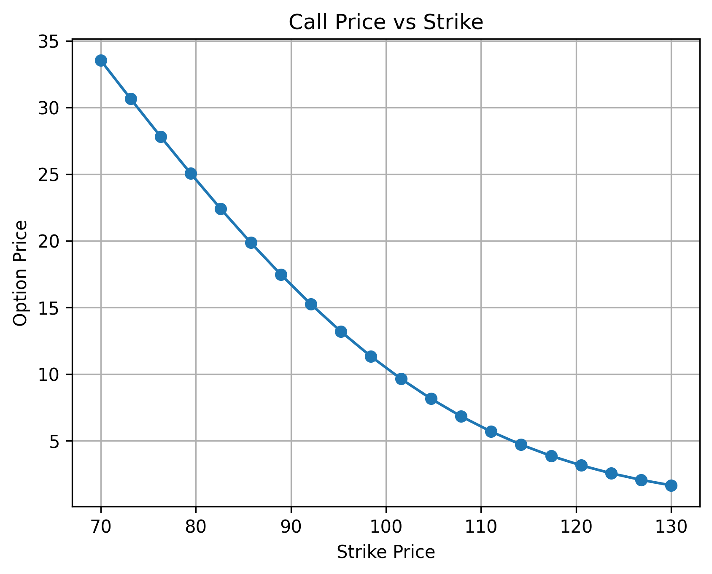
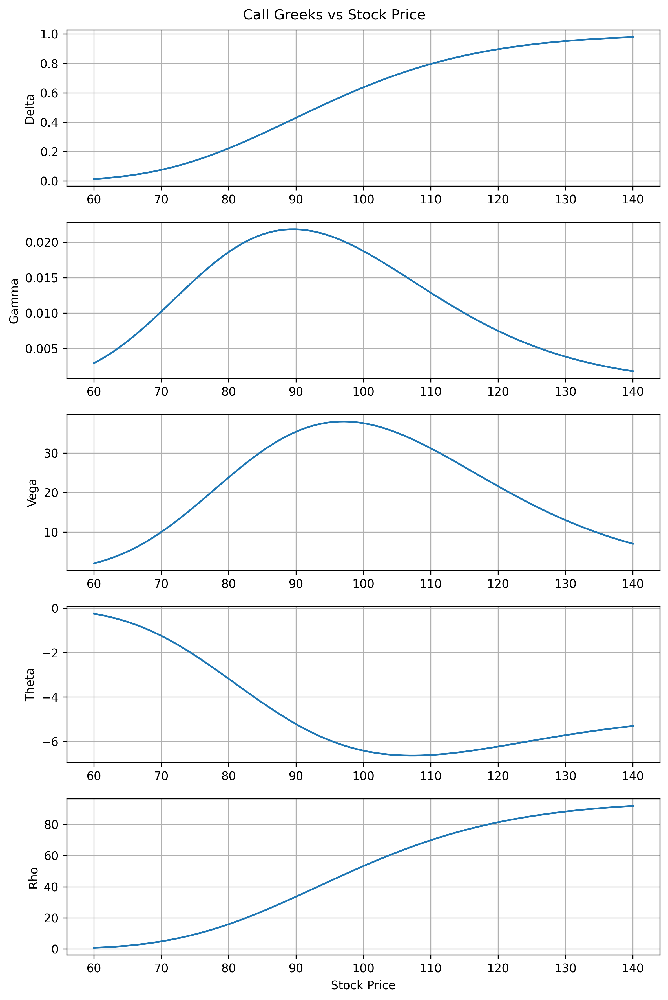
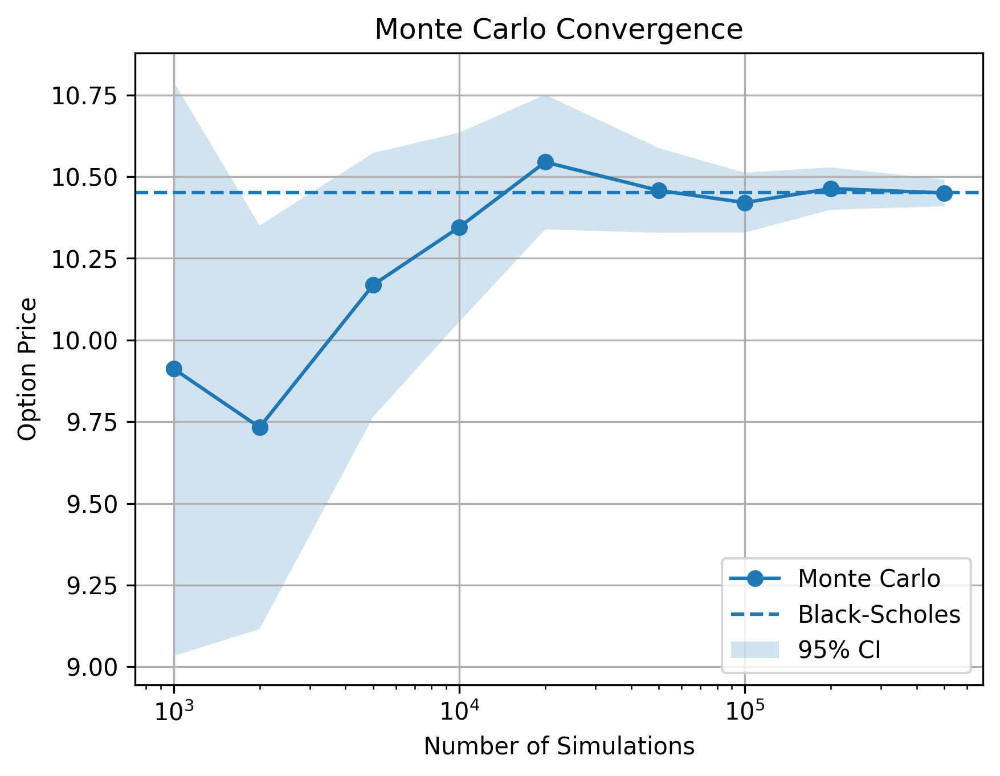
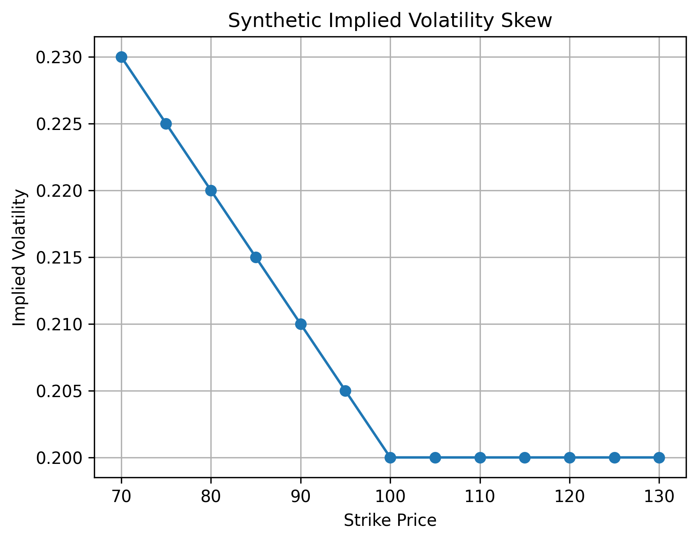

# Options Pricing and Volatility Analysis

A Python quantitative finance project implementing European option pricing, Greeks, implied volatility, Monte Carlo simulation, scenario analysis, and model validation.

## Features

* Black-Scholes pricing for European calls and puts
* Greeks: Delta, Gamma, Vega, Theta, Rho
* Implied volatility using Brent's root-finding method
* Monte Carlo pricing under risk-neutral GBM
* Monte Carlo standard errors and confidence intervals
* Black-Scholes vs Monte Carlo comparison and convergence analysis
* Stock-price, strike, volatility, and time-to-maturity scenario analysis
* Synthetic implied-volatility skew analysis
* **61 automated pytest tests** covering numerical correctness and financial model properties

## Project Structure

```text
Options-Project/
├── src/
│   ├── black_scholes.py
│   ├── greeks.py
│   ├── implied_volatility.py
│   ├── monte_carlo.py
│   ├── comparison.py
│   ├── scenario_analysis.py
│   └── visualization.py
├── tests/
│   ├── test_black_scholes.py
│   ├── test_greeks.py
│   ├── test_implied_volatility.py
│   ├── test_monte_carlo.py
│   ├── test_comparison.py
│   ├── test_scenario_analysis.py
│   ├── test_model_validation.py
│   └── test_visualization.py
├── scripts/
│   └── generate_plots.py
├── plots/
├── requirements.txt
└── README.md
```

## Validation

The test suite validates:

* Black-Scholes pricing against known values
* Call-put parity and no-arbitrage bounds
* Greek properties and signs
* Implied-volatility round trips
* Monte Carlo pricing and confidence intervals
* Monte Carlo convergence toward Black-Scholes
* Scenario-analysis outputs
* Visualization generation

```text
61 passed
```

## Visualizations

### Call & Put Prices vs Stock Price



### Option Price vs Volatility



### Option Price vs Time to Maturity



### Option Price vs Strike



### Greeks vs Stock Price



### Monte Carlo Convergence



### Synthetic Implied Volatility Skew



## Usage

Install dependencies:

```bash
pip install -r requirements.txt
```

Run tests:

```bash
python -m pytest
```

Generate visualizations:

```bash
python scripts/generate_plots.py
```

## Technologies

Python · NumPy · SciPy · Matplotlib · pytest
